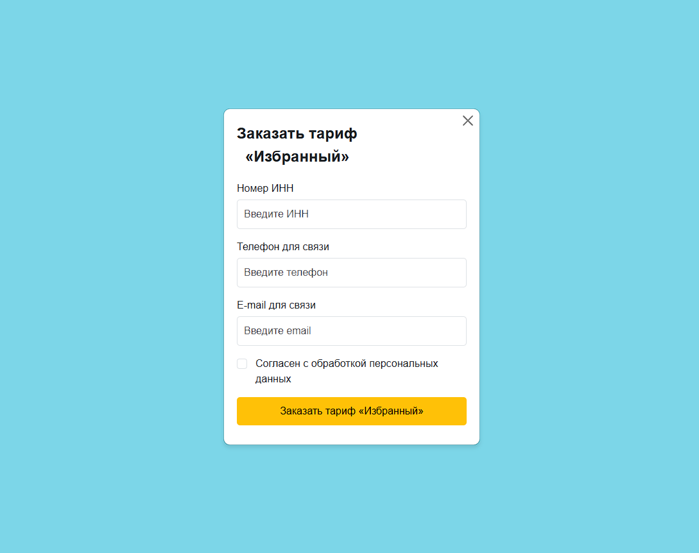

# PopupOrderForm

Модальное окно (pop-up) для оформления заказа тарифа «Избранный» — это компактное веб-приложение, которое предоставляет удобную форму для ввода данных (ИНН, телефон, email) с обязательным чекбоксом согласия. Форма включает валидацию данных на сервере и отображение сообщений об успехе или ошибке после отправки.

## Скриншот



## Основные функции

- **Форма заказа**: Содержит поля для ввода:
  - Номер ИНН (ровно 12 цифр, только числа).
  - Телефон для связи (ровно 11 цифр, только числа).
  - E-mail для связи (валидный формат, проверка на сервере).
- **Обязательный чекбокс**: Поле согласия с обработкой персональных данных.
- **Отправка данных**: Использование AJAX для отправки данных на сервер.
- **Обратная связь**:
  - При успешной отправке: сообщение "Спасибо! Успешно отправлено." (зеленым цветом).
  - При ошибке: сообщение "Ошибка: текст ошибки" (красным цветом, например, "Неверный формат email").
- **Очистка формы**: Форма очищается после успешной отправки.

## Технологии

- **Frontend**:
  - HTML5, CSS3 (Bootstrap 5 для стилизации и адаптивности).
  - JavaScript, jQuery (AJAX для связи с сервером).
- **Backend**:
  - PHP для валидации данных формы.
- **Зависимости**:
  - Bootstrap 5 (CDN).
  - jQuery (CDN).

## Установка

1. **Клонирование репозитория**:
   ```bash
   git clone https://github.com/ArtDeviant/PopupOrderForm.git
   ```
2. **Размещение файлов**:
   - Поместите файлы `index.html` и `submit.php` в директорию вашего веб-сервера (например, `htdocs` для Apache).
3. **Настройка сервера**:
   - Убедитесь, что ваш сервер поддерживает PHP (например, Apache с PHP 7+).
   - Убедитесь, что сервер имеет доступ к интернету для загрузки Bootstrap и jQuery через CDN.
4. **Запуск**:
   - Откройте `index.html` в браузере через сервер (например, `http://localhost/index.html`).

## Использование

1. Откройте приложение в браузере.
2. Нажмите кнопку "Открыть модальное окно" (расположена по центру экрана), чтобы вызвать форму.
3. Заполните поля:
   - ИНН: введите 12 цифр (например, 123456789012).
   - Телефон: введите 11 цифр (например, 79991234567).
   - Email: введите валидный адрес (например, user@example.com).
   - Отметьте чекбокс "Согласен с обработкой персональных данных".
4. Нажмите "Заказать тариф «Избранный»".
5. После отправки вы увидите:
   - Зеленое сообщение "Спасибо! Успешно отправлено." при успехе.
   - Красное сообщение "Ошибка: текст ошибки" при ошибке (например, "Неверный формат email").

## Структура проекта

- `index.html`: Основной файл с HTML-разметкой, стилями и JavaScript-кодом для модального окна.
- `submit.php`: Серверный скрипт для валидации и обработки данных формы.
- `screenshots/`: Папка для хранения скриншотов (например, `modal-window.png`).

## Ограничения

- ИНН должен содержать ровно 12 цифр.
- Телефон должен содержать ровно 11 цифр.
- Email должен быть валидным (проверка на сервере).
- Требуется PHP-сервер для работы валидации.

## Планы на будущее

- Добавить стилизацию под разные темы.
- Реализовать локализацию на других языках.
- Добавить поддержку базы данных для хранения данных формы.

## Лицензия

Проект распространяется под [MIT License](LICENSE).

## Контакты

Если у вас есть вопросы или предложения, пожалуйста, создайте issue в репозитории или свяжитесь с автором через GitHub.